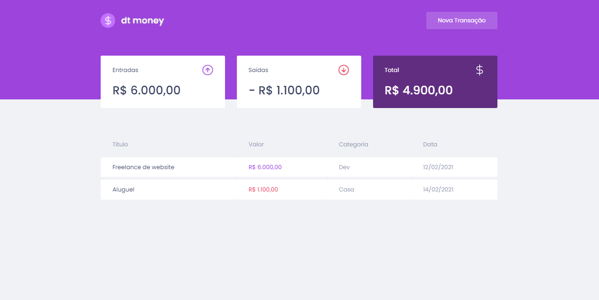

<h1 align="center">
  
</h1>

 

  

## ✨ Tecnologias

This project was developed with the following technologies:

- [React](https://reactjs.org)
- [TypeScript](https://www.typescriptlang.org/)

## 💻 Project

DtFinance is a financial control system developed in rocketseat's Ignite bootcamp.

## 🔖 Layout

You can view the project layout through [this link](https://www.figma.com/file/iLFkm80Hm9YeC0lMuasNFN/dtmoney-Ignite). You must have an account on [Figma](http://figma.com/) to access it.

